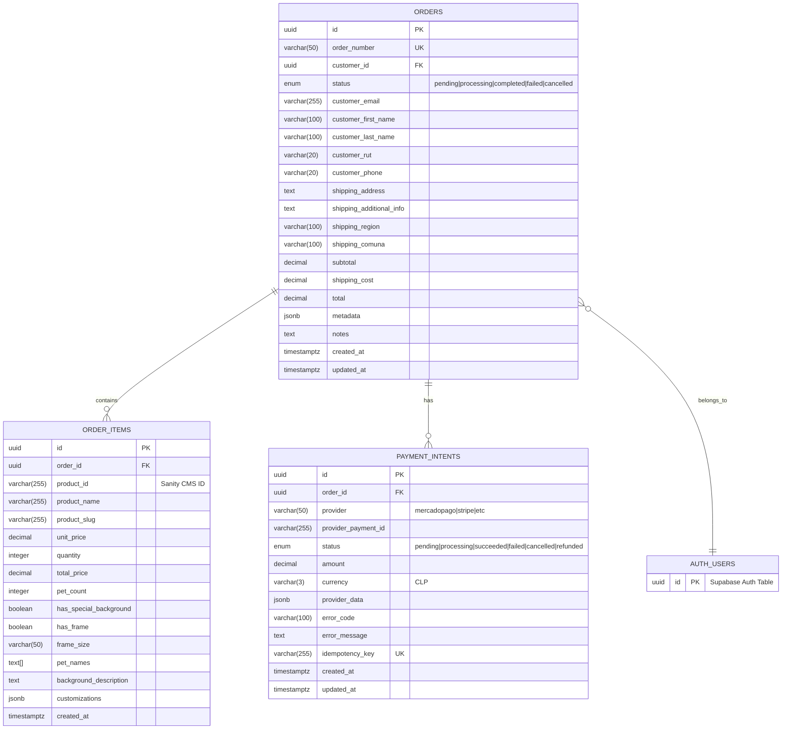
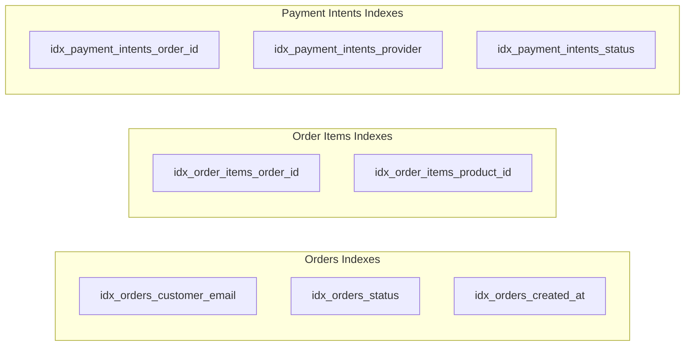
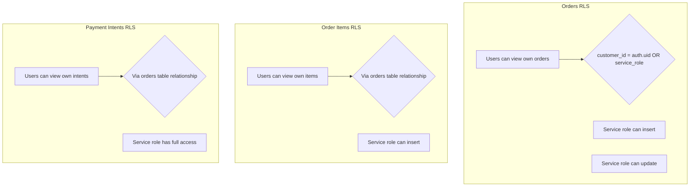
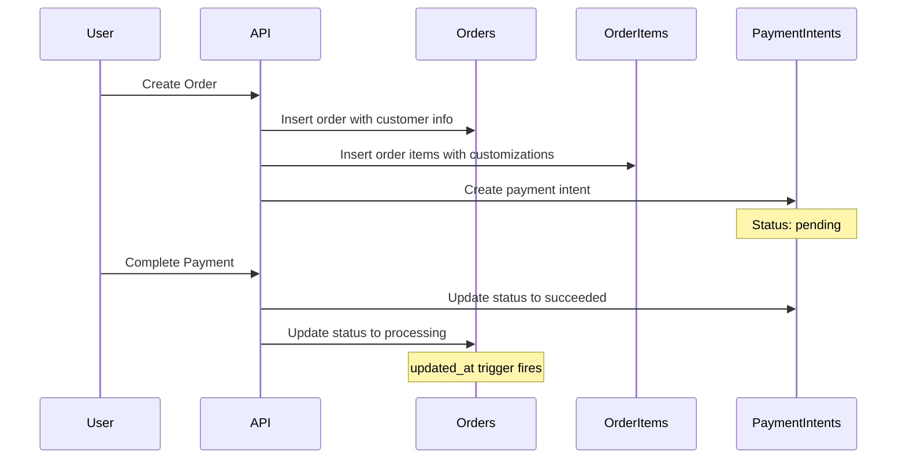

# Orders Database Schema

This document visualizes the database schema created by the `001_create_orders_tables.sql` migration.

## Entity Relationship Diagram

## Database Features

### Enums
- **order_status**: `pending`, `processing`, `completed`, `failed`, `cancelled`
- **payment_status**: `pending`, `processing`, `succeeded`, `failed`, `cancelled`, `refunded`

### Indexes

### Triggers
- **update_orders_updated_at**: Updates `updated_at` timestamp on orders table
- **update_payment_intents_updated_at**: Updates `updated_at` timestamp on payment_intents table

### Row Level Security (RLS)

## Key Relationships

1. **Orders → Auth Users**: Each order belongs to an authenticated user (optional)
2. **Orders → Order Items**: One-to-many relationship with CASCADE delete
3. **Orders → Payment Intents**: One-to-many relationship with CASCADE delete
4. **Unique Constraints**:
   - Order number must be unique
   - Only one payment intent per provider per order
   - Idempotency key must be unique

## Data Flow

## Security Model

- **RLS Enabled**: All tables have Row Level Security enabled
- **User Access**: Users can only view their own data
- **Service Role**: Backend services have full CRUD access
- **Cascade Deletes**: Deleting an order removes all related items and payment intents